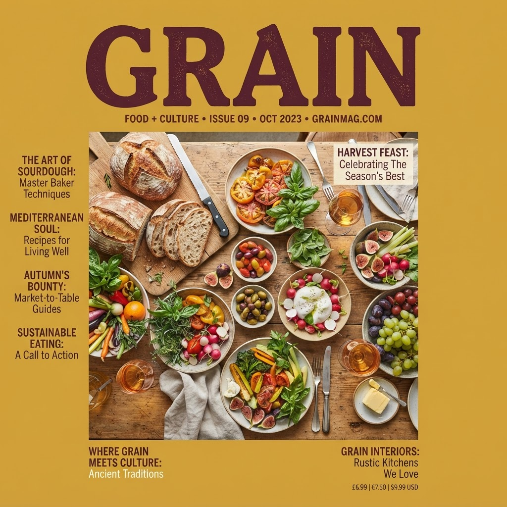
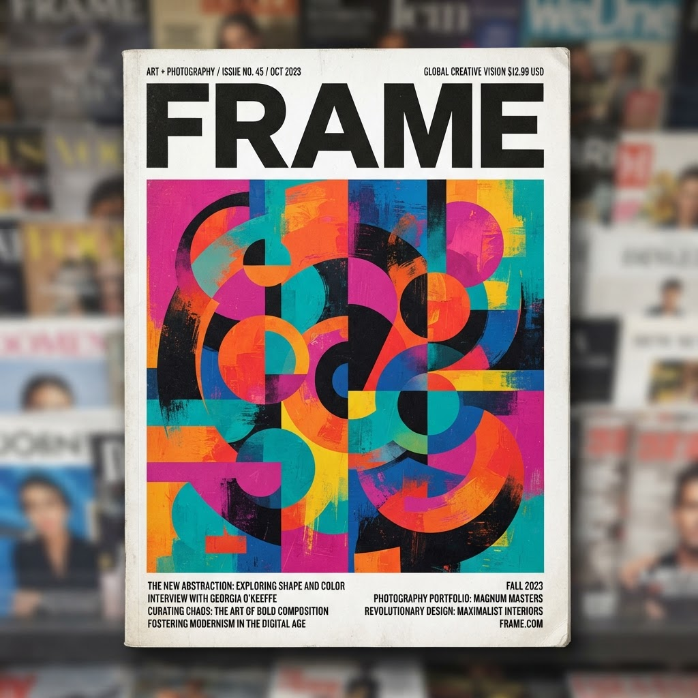

# Newsstand — Image Catalog

This document lists every image in the repository so you can preview and edit them.
The magazine covers are the source of truth for the storefront and are referenced
from [`lib/products.ts`](lib/products.ts) via the `image` field.

## How to edit a cover image

1. Drop a replacement file into `public/covers/` using the **same filename**
   (e.g. `orbit.png`) to swap a cover without touching any code.
2. To point a product at a different file, update the `image` field for that
   product in [`lib/products.ts`](lib/products.ts).
3. Covers are `.png`. Recommended aspect ratio is a portrait magazine cover
   (roughly 3:4). Keep filenames lowercase and matching the product `id`.

---

## Magazine Covers

Located in [`public/covers/`](public/covers/).

### Orbit — `public/covers/orbit.png`

| Field | Value |
| --- | --- |
| Product ID | `orbit` |
| Tagline | The future, decoded |
| Category | Tech & Future |
| Issue | Issue 42 |
| Price | $16.99 |

---

### Pulse — `public/covers/pulse.png`

| Field | Value |
| --- | --- |
| Product ID | `pulse` |
| Tagline | The world, in focus |
| Category | News & Affairs |
| Issue | Issue 118 |
| Price | $14.99 |

---

### Grain — `public/covers/grain.png`

| Field | Value |
| --- | --- |
| Product ID | `grain` |
| Tagline | Food is culture |
| Category | Food & Culture |
| Issue | Issue 27 |
| Price | $15.99 |

---

### Vantage — `public/covers/vantage.png`

| Field | Value |
| --- | --- |
| Product ID | `vantage` |
| Tagline | How we build |
| Category | Design & Architecture |
| Issue | Issue 09 |
| Price | $18.99 |

---

### Terra — `public/covers/terra.png`

| Field | Value |
| --- | --- |
| Product ID | `terra` |
| Tagline | Go further |
| Category | Travel & Outdoors |
| Issue | Issue 55 |
| Price | $15.99 |

---

### Frame — `public/covers/frame.png`

| Field | Value |
| --- | --- |
| Product ID | `frame` |
| Tagline | Look closer |
| Category | Art & Photography |
| Issue | Issue 14 |
| Price | $17.99 |

---

### Current — `public/covers/current.png`

| Field | Value |
| --- | --- |
| Product ID | `current` |
| Tagline | The business of now |
| Category | Business & Finance |
| Issue | Issue 71 |
| Price | $16.99 |

---

### Noise — `public/covers/noise.png`

| Field | Value |
| --- | --- |
| Product ID | `noise` |
| Tagline | Turn it up |
| Category | Music & Culture |
| Issue | Issue 33 |
| Price | $14.99 |

---

## Icons & Branding

Located in [`public/`](public/).

| Preview | File | Purpose |
| --- | --- | --- |
|  | `public/icon.svg` | Primary site icon (SVG) |
|  | `public/apple-icon.png` | Apple touch icon |
|  | `public/icon-light-32x32.png` | Favicon (light mode) |
|  | `public/icon-dark-32x32.png` | Favicon (dark mode) |

## Placeholders (unused defaults)

These ship with the starter template and are not used by the storefront.

- `public/placeholder-logo.png`
- `public/placeholder-logo.svg`
- `public/placeholder-user.jpg`
- `public/placeholder.jpg`
- `public/placeholder.svg`
